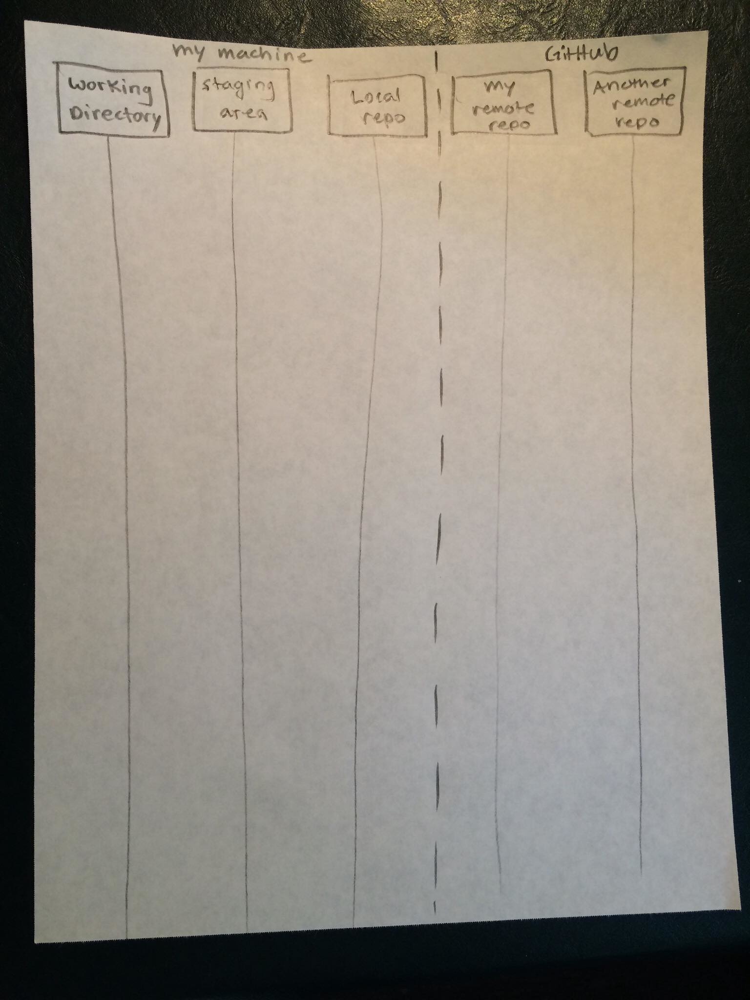
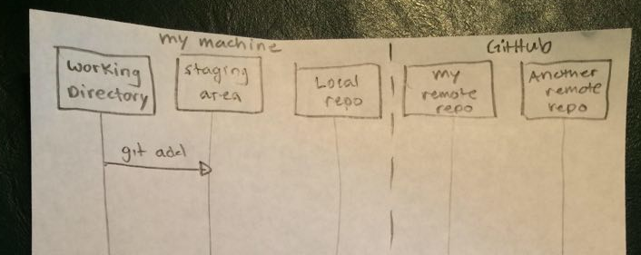
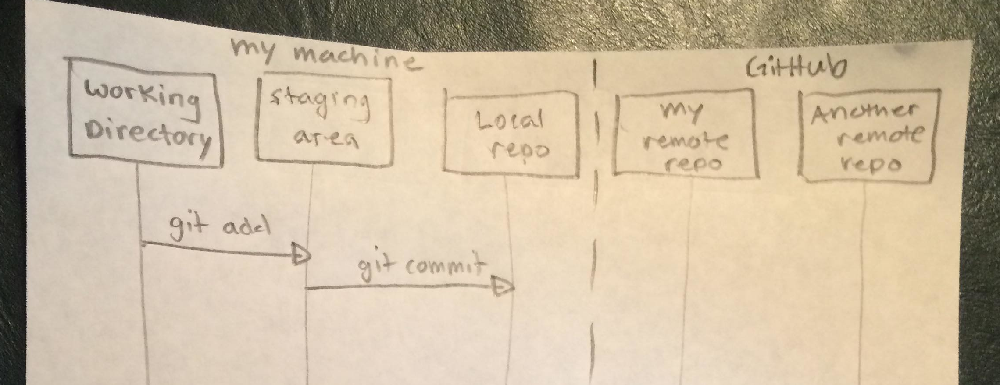

# Create your own workflow chart

In the next two activities, you'll practice tracking and sharing your work and collaborating on a project.
During those activities, you'll create your own flow chart showing which git commands move changes between which parts of a git project.

## Goals
1. To help you internalize what are the parts of a git project and how changes are moved between them, 
2. To give you something to reference as you use git in the future, and
3. To help us identify any misunderstandings and give you feedback.

## You'll need
- a piece of paper
- a pencil
- an eraser

(you can use a pen, but you'll probably make some mistakes, so a pencil and eraser would be better)

## Steps
### 1. Draw the parts of a git project
Draw this on your paper:

### 2. Draw an arrow for commands that move changes.
As you go through the tasks, when you run a git command that moves a change between these parts of a git project, draw an arrow on the paper to show where you've moved a change, and label it with the command. E.g.,
  - When I stage a change with `git add`, I draw an arrow like this:
  
  

  - When I commit the staged change with `git commit -m <commit message>`, I draw this:
  
  

  - When I push the committed changes to github with `git push <remote shortname> <branch name>`, I draw this:

  

  - Note that some git commands don't move changes around. E.g., `git branch`, `git log`, `git status`, `git init`. You don't need to put such commands on the drawing. 

  - If you run a command more than once, draw it again. This will help reinforce things.

### 3. Send me a picture of your drawing.
At some point during the tutorial, I'll ask everyone to a picture of it of their draing and send it to me on Slack in the
`#05-intro-to-git-github` channel

### 4. I'll review the pictures.
You'll a have a short break while I look at the pictures to see if anyone has misunderstood anything (e.g., I'll note if someone writes `git add` on an arrow between "my remote repo" and "another remote repo").

### 5. We'll discuss any problems I identified - and answer your questions
(e.g., I'll explain that `git add` moves changes between the working directory and the staging area) 
